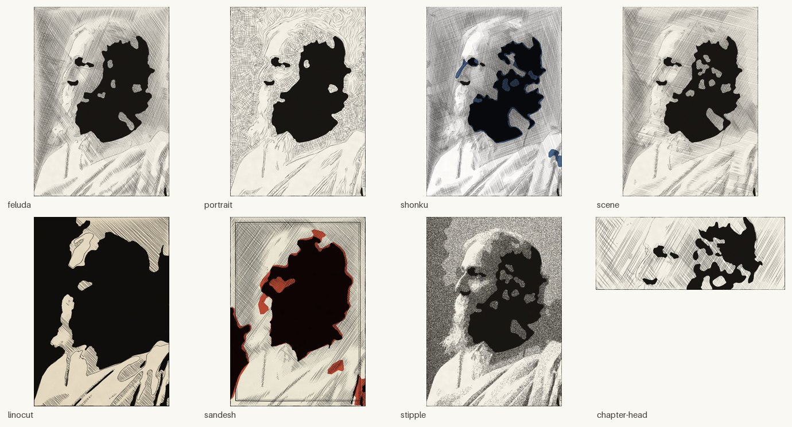
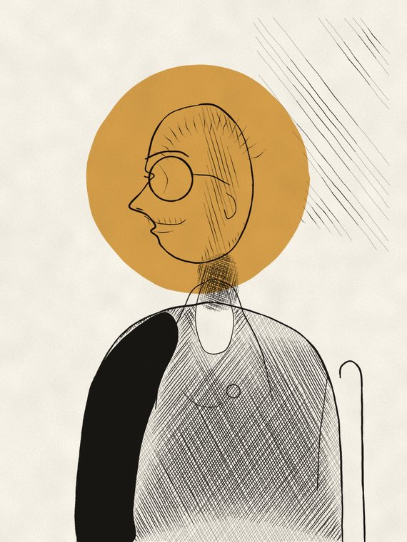
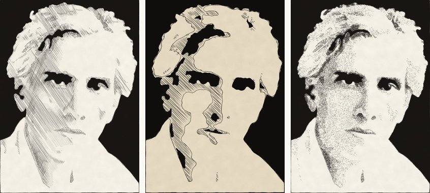

# kalam

A tool that turns photographs into pen-and-ink illustration plates in the register
Satyajit Ray worked in — the *Sandesh* covers, the Feluda and Shonku interiors.
Output is a raster plate plus a print-ready SVG of the same geometry.

`kalam` is কলম, pen.



*Eight presets, one source photograph ([Rabindranath Tagore, 1909](https://commons.wikimedia.org/wiki/File:Rabindranath_Tagore_in_1909.jpg), public domain).*

## What it does, and what it does not

It produces **engraved and woodcut-style plates from a reference image**. It does not
invent illustrations from a text prompt, and it is not a filter — the marks are real
geometry, so the SVG is editable and scales for print.

Be clear about the limit: an artist's line describes *the edge of a thing*. An
algorithm reading a photograph can only describe *tone*. So `kalam` reliably reaches
"fine engraving of a photograph" and deliberately aims there. The very economical
Ray plate — six decisive strokes, nothing else — needs a human deciding what to
leave out. `linocut` gets closest by reducing hardest.

## Install

```bash
python -m venv .venv && .venv/bin/pip install -e .
```

## Use

```bash
kalam presets                                     # list looks, inks, papers
kalam render photo.jpg -o plate.png               # one plate + plate.svg
kalam render photo.jpg -o plate.png -p stipple --spot brick
kalam variants photo.jpg -o out/ -n 4             # same plate, different hands
kalam sheet photo.jpg -o sheet.png                # every preset, side by side
kalam stages photo.jpg -o out/stages              # intermediates, for tuning
kalam demo -o out/demo                            # synthetic subject, no input needed
```

Presets are starting points; overrides stack on top of any of them.

```bash
kalam render photo.jpg -o plate.png -p feluda \
  --spacing-scale 0.8 --width-scale 1.2 --angle 30 --gamma 1.1 \
  --paper newsprint --spot ochre --border sandesh --preview 800
```

`--seed` controls every random decision. Same seed, same plate; change it and you get
the same drawing in a different hand.

## Presets

| preset | for |
|---|---|
| `feluda` | interior line plate: one ink, heavy silhouette, crossing hatch |
| `portrait` | hatching that follows the form of a face |
| `shonku` | fine scratchy nib, four crossing passes, indigo second ink |
| `scene` | architecture and landscape, long rule hatching |
| `linocut` | maximum reduction: two tones, big flat masses |
| `sandesh` | two-ink cover, ruled border, spot deliberately out of register |
| `stipple` | dotted tone for mist, dusk, smoke |
| `chapter-head` | wide banner that dissolves at the margins, to sit above text |

## How it works

```
photograph
  -> mean-shift flattening        genuinely flat tonal plateaux
  -> global grading               levels and gamma only; no local contrast
  -> quantise at ~40% resolution  a band index map, median-simplified
  -> cumulative hatching passes   each covers everything below its threshold
  -> silhouette and detail        heavy outer line, fine interior accents
  -> composite                    paper grain, second ink out of register
  -> raster + SVG
```

Four decisions carry most of the quality, and all four were arrived at by looking at
failed output:

**Hatching passes are cumulative, not disjoint.** Early versions hatched each tonal
band separately, over its own slice of tone only. Every band boundary then became a
visible coastline and plates read as contour maps of amoebas. Real hatching layers up:
a sparse pass over everything below mid-tone, another at a different angle over what
is darker, and so on. Darker areas simply collect more passes, each boundary is buried
under the next, and tone gradates smoothly. This is the single most important thing in
the codebase.

**No local contrast.** CLAHE was in the pipeline to recover fine detail. It also
destroys the global light-and-shadow hierarchy — the coherent shadow mass of a face
shatters into scattered specks, and the plate becomes unreadable. Global levels only.

**Quantise small, draw large.** Bands are decided at ~40% resolution on an index map.
A pen drawing of a face is not a per-pixel decision about every pore; it is a handful
of decisive regions. Deciding regions coarsely and drawing them at full resolution is
what keeps a plate legible.

**Every mark is imperfect on purpose.** Lines wobble off true with smooth noise, taper
at both ends so they read as a nib lifting, stop just short of the outline rather than
butting into it, and vary in width along their length. Fill edges are wobbled to match.
Perfectly straight hatching reads as machine output instantly.

## The character

[**অখিলেশ বোস — Akhilesh Bose**](characters/akhilesh-bose.md) is the original
protagonist this repository exists to illustrate: a retired railway signal
engineer in a small junction town in 1963, who solves crimes by noticing what ran
late. Deliberately built by inverting the familiar model — sixty-one, short,
limping, unlicensed, slow, and not brilliant. The character notes cover method,
physical silhouette, the people around him, and recurring visual motifs.



An invented character has no reference photograph, so his plate is
**hand-authored geometry rendered through kalam's own primitives** — see
[`plates/akhilesh_bose.py`](plates/akhilesh_bose.py). Control points are smoothed
with Catmull-Rom, rasterised to masks, then hatched and outlined by the same
engines the photographic presets use, so the plate shares their hand.

It is honestly a mediocre drawing. The composition, ink, paper and second-colour
registration are good; the face is not. Hand-authoring a convincing head by
nudging coordinates has sharp diminishing returns, and the fix is the one a real
illustrator would reach for — **work from reference**. Rendering an actual
photograph of a suitable sitter produces something far better:



*`feluda`, `linocut`, `stipple` on a photographic reference. The outer two work;
`linocut` over-reduces and inverts the tone.*

So the production route for the books is: photograph a model in the character's
costume and pose, then run the plate. The hand-authored script stays useful for
ornaments, motifs and lettering, where geometry beats reference.

## Known limitations

- **Background removal (`--isolate`) is unreliable.** Flood-fill from the frame edge
  works on plain studio backdrops; anything busy, or dark hair against a dark corner,
  and it leaks. It fails safe — a bad mask is discarded rather than used. A tight crop
  is usually better.
- **SVGs are large** (5–15 MB). Tapered strokes are written as outline polygons, which
  is faithful but verbose.
- **`chapter-head` crops blind.** The banner crop is geometric, so on some subjects it
  slices through the face. Crop the source yourself for that preset.
- Renders take roughly 20–40 s at 1600 px.

## Layout

```
kalam/
  stroke.py     Stroke and FilledShape primitives; raster + SVG renderers
  core.py       loading, flattening, grading, quantisation, subject isolation
  hatch.py      parallel, cross, flow (form-following) and stipple engines
  contour.py    contours from tonal boundaries, swelling outlines, ink masses
  plate.py      preset description and plate assembly
  presets.py    the eight looks
  diagnose.py   stage dumps for tuning
  cli.py        command line interface
tools/          contact sheets and parameter probes
```

## Credit and scope

The visual language is Satyajit Ray's; the presets are an attempt at his register, not
a reproduction of his work. His published plates are in copyright. Make original
compositions with this.

Sample image: [Rabindranath Tagore, 1909](https://commons.wikimedia.org/wiki/File:Rabindranath_Tagore_in_1909.jpg),
via Wikimedia Commons, public domain by age.
